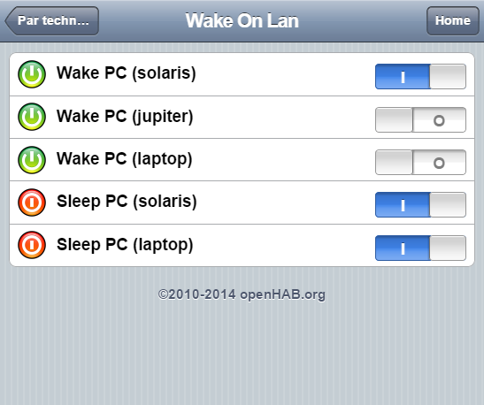

# Sleep-On-LAN (SOL)

## Principle

Wake-on-LAN is a standard low-level protocol implemented in various hardware. At this time, there is not standard to make the opposite and send a computer in sleep mode.

This project allows a windows or linux box to be put into sleep from any other device. 

It works with the exact same magic packet than for Wake-On-LAN, the only difference is that the MAC address has to be written in reverse order.

Technically, you have to run a little daemon (the `sleep-on-lan` program on your computeri, server, NAS, ... that will listen the same Wake-On-LAN port and send the computer in sleep mode when the reversed MAC address received matches a local address. Additionnaly, it can also be triggered through a REST endpoint (with something like `curl`). Executed commands are fully customizable.

Written in `go`, the code shoud run on linux and windows platforms.

## Usage

Grab the latest windows + linux release or snapshot : https://github.com/SR-G/sleep-on-lan/releases/

### Sleep through UDP

Just send a regular wake-on-lan command but with a reversed MAC address. Thus, the same wake-on-lan tools may be used for both wake and sleep operations (python wake-on-lan script, OpenHab WoL plugin, Android applications, and so on).

Provided you are using a wake-on-lan script like this one : [wake-on-lan python script](https://github.com/jpoliv/wakeonlan) (available as a debian package for example), you may use :

<pre>wakeonlan c4:d9:87:7a:78:35 192.168.255.255 // regular mac address, will wake an asleep computer
wakeonlan 35:78:7a:87:d9:c4 192.168.255.255 // reversed mac address, will trigger the UDP listener of the sleep-on-lan process and will thus remotely sleep the computer
</pre>

### Sleep through REST service

If this HTTP listener is activated, the Sleep-On-Lan process then exposes a few REST services, for example :

<pre>http://127.0.0.1:8009/                               // index page, just shows local IP / mac
http://127.0.0.1:8009/sleep                          // remotely sleep this computer through this URL
http://127.0.0.1:8009/wol/c4:d9:87:7a:78:35          // sends a wake-on-lan magic packet on the network to the provided mac address
</pre>

(all available endpoints are displayed in the logs of the process when it starts)

## Configuration

An optional configuration file may be used.

Taken automatically in account if named `sol.json` and located in the same folder than the Sleep-On-Lan binary. Or can be manually configured at launch time with the `--config` parameter. See [configuration examples](resources/configuration/default/).

Content of configuration is as follow (everything is optional / below is the whole structure) :

<pre>{
  "Listeners" : ["UDP:9", "HTTP:8009" ],
  "Auth" : {
      "Login" : "myusername",
      "Password" : "mypassword"
  },
  "ExitIfAnyPortIsAlreadyUsed" : false,
  "AvoidDualUDPSending" : {
          "Active": true,
          "Delay": "100ms"
  },
  "LogLevel" : "INFO",
  "BroadcastIP" : "255.255.255.255",
  "Commands" : []
}
</pre>

**Listeners** defines which mechanism will be activated

- UDP         : will listen on the default port (= 9)
- UDP:&lt;port&gt;  : will listen on the provided port 
- HTTP        : will listen on the default port (= 8009)
- HTTP:&lt;port&gt; : will listen on the provided port

Several listeners may be defined (e.g., "UDP:7", "UDP:9", "HTTP:8009")

If no configuration file is provided, UDP:9 and HTTP:8009 are assumed by default.

The REST services are exposed on 0.0.0.0 and are thus accessibles from http://localhost/, http://127.0.0.1/, http://192.168.1.x/ and so on.

Rest service may be secured if needed through an optional `Auth` configuration (a `Basic Auth` is triggered on all REST services as soon as this `Auth` section is defined) : 

<pre>{
  "Listeners" : ["UDP:9", "HTTP:8009" ],
  "Auth" : {
      "Login" : "myusername",
      "Password" : "mypassword"
  }
}
</pre>

Authed REST may still be triggered from a remote host, if needed, through : 

```
curl http://myusername:mypassword@<IP>/sleep/
```

Default output from REST command is `XML` but may be switched from a configuration point of view (by adding a `HTTPOutput : 'JSON'`) or on a per-request basis (by adding a `?format=JSON` to the request, one would retrieve a JSON result).

**LogLevel** defines the log level to use. Available values are NONE|OFF, DEBUG, INFO, WARN|WARNING, ERROR. Logs are just written to the stderr/stdout outputs.

**BroadcastIP** defines the broadcast IP used by the /wol service. By default the IP used is 192.168.255.255 (local network range).

**ExitIfAnyPortIsAlreadyUsed** if `true`, the daemon will stop if any port can't be started, whereas if `false` (which is the default), it will continue to start (you may be willing the daemon to be running even if one listener is not startable).

**AvoidDualUDPSending** to activate one internal mechanizm allowing a small delay before executing commands. This may allow dual UDP sent by some clients to be discarded, instead of being executed twice. False by default. Delay (if feature is enabled) is 100ms by default (can be overriden to something like "1s", ...)

<pre>
{
  "LogLevel" : "INFO",
  "AvoidDualUDPSending" : {
          "Active": true,
          "Delay": "100ms"
  }
}
</pre>

**Commands** defines the available commands.

By default, on both windows and linux, only one command is defined : sleep command (through "pm-suspend" on linux and a DLL API call on windows).

You may customize / override this behavior, or add new commands (that will then be available under `http://<IP>:<HTTP PORT>/<operation>` if a HTTP listener is defined), if needed.

Each command has 4 attributes :
- "Operation" : the name of the operation (for the HTTP url)
- "Type" : the type of the operation, either "external" (by default, for remote execution) or "internal-dll" (on windows, to trigger a sleep  through a DLL API call)
- "Default" : true or false. Default command will be executed when UDP magic packets are received. If only one command is defined, it will automatically be the default one
- "Command" : for external commands, the exact command that has to be executed (see examples below). May have to contain full path on windows.

Example 1 : only one (default) operation that will shutdown the system on windows. Through HTTP, the operation will be triggerable with `http://<IP>:<PORT_HTTP>/halt/`.

<pre>
  "Commands" : [ 
    {
        "Operation" : "halt",
        "Command" : "C:\\Windows\\System32\\Shutdown.exe -s -t 0"
    }]
</pre>

Example 2 : force sleep on windows through the rundll32.exe trick (and not through the default API call)

<pre>
  "Commands" : [ 
    {
        "Operation" : "sleep",
        "Command" : "C:\\Windows\\System32\\rundll32.exe powrprof.dll,SetSuspendState 0,1,1"
    }]
</pre>

Example 3 : default operation will put the computer to sleep on linux and a second operation will be published to shutdown the computer through HTTP.

<pre>
  "Commands" : [ 
    {
        "Operation" : "halt",
        "Command" : "pm-halt",
        "Default" : false
    },
    {
        "Operation" : "sleep",
        "Command" : "pm-sleep",
        "Default" : true
    }]
</pre>

## Installation

### Under windows

The Sleep-On-Lan process may be run manually or, for convenience, installed as a service. The easiest way to install the Sleep-On-Lan service is probably to use [NSSM](https://nssm.cc/) (the Non-Sucking Service Manager).

Usage :

<pre>nssm install &lt;service name&gt; &lt;full path to binary&gt;
</pre>

Installation example :

<pre>c:\Tools\nssm\2.24\win64\nssm.exe install Sleep-On-Lan c:\Tools\Sleep-On-Lan\sol.exe
</pre>

Removal example : 

<pre>c:\Tools\nssm\2.24\win64\nssm.exe remove Sleep-On-Lan confirm
</pre>

Reference : [nssm](https://nssm.cc/usage)

### Under Linux

#### Port & rights on processes

The Sleep-On-Lan process must use (usually) port 9 (see configuration section if you need another port or if you need to listen to several UDP ports).

Thus the process has either to be ran as `root`, either has to have the authorization to start on ports &lt; 1024.

The following example allows the process to run on ports &lt; 1024 on recent Linux kernels (for example on ubuntu) :

<pre>sudo setcap 'cap_net_bind_service=+ep' /path/to/sol_binary
nohup /path/to/sol_binary &gt; /var/log/sleep-on-lan.log 2&gt;&1 &
</pre>

So to summarize : if you are facing the error inside logs `listen udp :9: bind: permission denied`, you either need to run the program as root, either to apply the proper setcap permission.

#### Daemonization

You may of course daemonize the process or launch it through an external monitor : 
- [monit](http://mmonit.com/monit/) 
- [supervisor](http://supervisord.org/introduction.html)
- [systemctl](https://www.freedesktop.org/software/systemd/man/systemctl.html)
  1. Create the file `/etc/systemd/system/sleep-on-lan.service` with the following content (adjust the path accordingly to your installation)
      ```
      [Unit]
      Description=Sleep-On-LAN daemon

      [Service]
      User=root
      WorkingDirectory=/home/applications/sleep-on-lan
      ExecStart=/home/applications/sleep-on-lan/sol
      Restart=always

      [Install]
      WantedBy=multi-user.target
      ```
  2. Refresh configuration, activate service at runtime and start it : 
      ```bash
      systemctl daemon-reload
      systemctl enable sleep-on-lan.service
      systemctl start sleep-on-lan.service
      ```
  3. Logs are then found in a regular way inside `journalctl` (`journalctl -xe`, ...)


## Miscellaneous

### Troubleshooting

If Sleep-on-LAN cannot be triggered remotely, but the service is running and the ports are open, a firewall may be in the way. For example on Windows 10, add a rule to _Windows Defender_ to allow incoming TCP traffic on port `8009` for the REST example above.

### Logs

Expected logs when starting the process should be : 

```
WARNING: 2021/07/04 16:01:29 sol.go:52: Configuration file provided through --config parameter not found on disk, path is [resources/sol.json2], will try default value
INFO: 2021/07/04 16:01:29 configuration.go:76: No external configuration file found under [/root/go/bin/sol.json], will use default values
INFO: 2021/07/04 16:01:29 configuration.go:140: Daemon won't stop even if one listener can't be started (per `ExitIfAnyPortIsAlreadyUsed` configuration)
INFO: 2021/07/04 16:01:29 configuration.go:147: Avoid dual UDP sending not enabled
INFO: 2021/07/04 16:01:29 sol.go:63: Application [sleep-on-lan], version [1.0.6-SNAPSHOT]
INFO: 2021/07/04 16:01:29 sol.go:66: Now starting sleep-on-lan, hardware IP/mac addresses are : 
INFO: 2021/07/04 16:01:29 sol.go:68:  - local IP adress [127.0.0.1/8], mac [], reversed mac []
INFO: 2021/07/04 16:01:29 sol.go:68:  - local IP adress [192.168.8.4/24], mac [bc:5f:f4:2b:df:2b], reversed mac [2b:df:2b:f4:5f:bc]
INFO: 2021/07/04 16:01:29 sol.go:68:  - local IP adress [172.18.0.1/16], mac [02:42:5d:9a:cf:7d], reversed mac [7d:cf:9a:5d:42:02]
INFO: 2021/07/04 16:01:29 sol.go:68:  - local IP adress [172.17.0.1/16], mac [02:42:0c:62:d1:6a], reversed mac [6a:d1:62:0c:42:02]
INFO: 2021/07/04 16:01:29 sol.go:72: Available commands are : 
INFO: 2021/07/04 16:01:29 sol.go:74:  - operation [sleep], command [pm-suspend], default [true], type [external]
INFO: 2021/07/04 16:01:29 listener_http.go:160: HTTP starting on port [8009], without auth
INFO: 2021/07/04 16:01:29 listener_http.go:85: Registering route [/]
INFO: 2021/07/04 16:01:29 listener_http.go:85: Registering route [/sleep]
INFO: 2021/07/04 16:01:29 listener_http.go:85: Registering route [/quit]
INFO: 2021/07/04 16:01:29 listener_http.go:85: Registering route [/state/local/online]
INFO: 2021/07/04 16:01:29 listener_http.go:85: Registering route [/state/local]
INFO: 2021/07/04 16:01:29 listener_http.go:85: Registering route [/state/ip/:ip]
INFO: 2021/07/04 16:01:29 listener_http.go:85: Registering route [/wol/:mac]
INFO: 2021/07/04 16:01:29 listener_udp.go:15: Now listening UDP packets on port [9]
⇨ http server started on [::]:8009
```

### Standalone sleep on lan under windows

Another way to sleep a windows computer remotely :

<pre>net rpc SHUTDOWN -f -I xxx.xxx.xxx.xxx -U uname%psswd
</pre>

### Other similar projects

- [Sleep On Lan](https://github.com/philipnrmn/sleeponlan) (pure java implementation, magic anti-packet starts with 6 * 0x00 instead of 6 * 0xFF)

### OpenHab configuration

Example of configuration under OpenHab.



This is a very standard configuration : MAC addresses have just to be reversed.

<pre>
Switch  Network_WoL_Solaris   	"Wake PC (solaris)"   <wake>		(WoL, Status, Network)   { wol="192.168.8.255#14:da:e9:01:98:19" }
Switch  Network_WoL_Jupiter   	"Wake PC (jupiter)"   <wake>		(WoL, Status, Network)   { wol="192.168.8.255#bc:5f:f4:2b:df:26" }
Switch  Network_WoL_Laptop   	"Wake PC (laptop)"    <wake>		(WoL, Status, Network)   { wol="192.168.8.255#C4:D9:87:7A:78:35" }

Switch  Network_SoL_Solaris   	"Sleep PC (solaris)"  <sleep>		(WoL, Status, Network)   { wol="192.168.8.255#19:98:01:e9:da:14" }
Switch  Network_SoL_Laptop   	"Sleep PC (laptop)"   <sleep>		(WoL, Status, Network)   { wol="192.168.8.255#35:78:7A:87:D9:C4" }
</pre>

## Developement

### Regular operations

A few commands are available through the provided `Makefile` : 

- Launch a `golang` docker container (to be executed from host) :

```bash
make docker
```

- Create binaries (from the inside of the container) :

```bash
make install
```

- Create distribution (from the inside of the container - note, `zip` package is required) :

```bash
make distribution
```

- Clean everything : 

```bash
make clean
```

- Launch the generated binary (from the inside of the container) : 

```bash
make run
```

### Release procedure

- Update release version in makefile
- Commit everything & create new tag
```bash
git add .
git commit -m"Prepare 1.1.0 RELEASE"
git push origin master
git tag 1.1.0-RELEASE 
git push origin 1.1.0-RELEASE 
```
- Create distribution `make distribution` and upload the ZIP generated under `bin/*.zip` on GitHub
- Change Makefile (increase number, switch back to SNAPSHOT)
